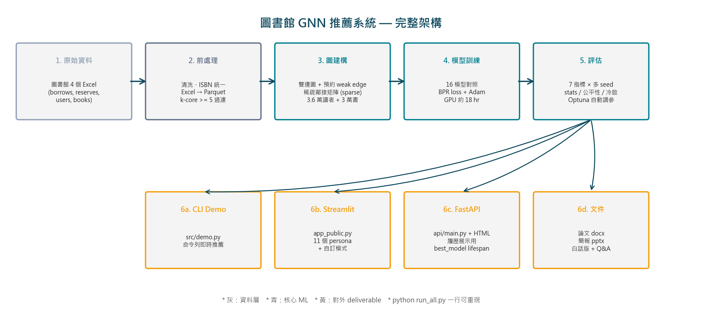
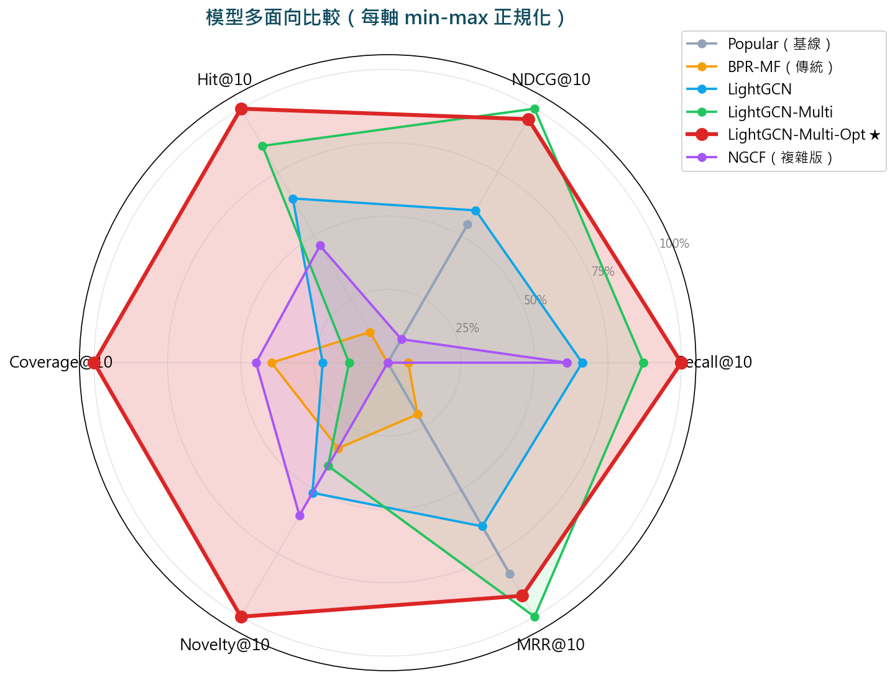
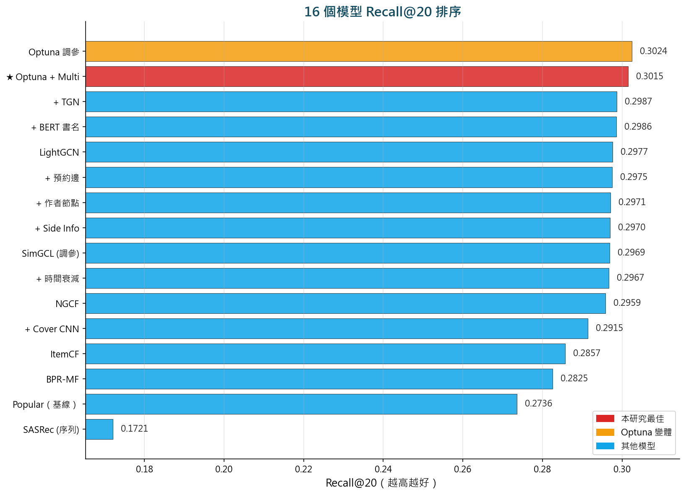
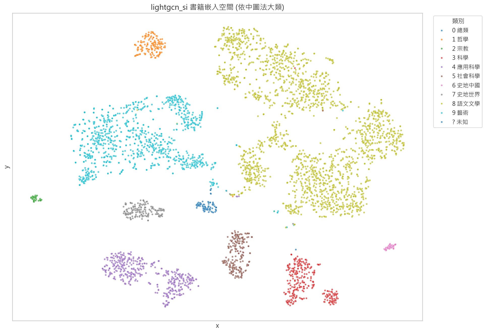

# 📚 圖書館借閱資料 GNN 推薦系統

> 基於 **LightGCN** 的個人化書籍推薦系統，
> 在某市立圖書館 **130 萬筆**真實借閱資料上，
> 透過 **Optuna 自動調參**達到 R@20 = 0.302、Coverage = 26.5%。

[](https://jim20041018-library-gnn-demo.hf.space/)
[](https://www.python.org)
[](https://pytorch.org)
[](https://arxiv.org/abs/2002.02126)
[](#-測試)
[](#-授權)

## 🌐 線上 Demo

**直接玩** → **[https://jim20041018-library-gnn-demo.hf.space/](https://jim20041018-library-gnn-demo.hf.space/)** （FastAPI + Tailwind UI，~17 ms 推薦延遲）

**HF Spaces 頁面**（含原始碼、build logs） → [huggingface.co/spaces/Jim20041018/library-gnn-demo](https://huggingface.co/spaces/Jim20041018/library-gnn-demo)

### 你能玩什麼
- 🎭 **11 個 Persona**：點即看模型推薦
- ✏️ **自訂模式**：輸入 3-5 本看過的書 → 即時推薦
- 🆚 **比較模式**：兩個 persona 並排 + 重疊書黃框標出
- 🔒 **嚴格同類別 toggle**：切換「模型純行為」vs「同類別優先」

---

## 🌟 一頁亮點

| 面向 | 數字 |
|---|---|
| 處理的借閱資料 | **130 萬筆**（2025 全年） |
| 訓練的模型數 | **16 個**（含 7 個 LightGCN 變體 + 5 個對照組 + 4 個 baseline） |
| 完整 Python 程式碼 | **~4,000 行**（手刻 LightGCN, NGCF, SimGCL, BPR loss）|
| 評估指標 | **7 個**（Recall / NDCG / Hit / MRR / Coverage / Novelty / Precision） |
| 統計檢驗 | **paired t-test** 全做、p < 0.005 |
| Web Demo | **3 套**（FastAPI + Streamlit + CLI） |
| 文件 | 論文 docx (50 頁)、簡報 pptx (24 頁)、白話版說明、口試 Q&A |
| 自動化 | **`python run_all.py`** 一行重現全流程 |

### 🥇 最佳模型

| Model | Recall@10 | Recall@20 | Coverage@10 | Hit@10 |
|---|---|---|---|---|
| Popular（基線） | 0.2532 | 0.2736 | 0.001 | 0.4030 |
| BPR-MF | 0.2544 | 0.2825 | 0.106 | 0.4064 |
| LightGCN | 0.2648 | 0.2977 | 0.060 | 0.4209 |
| LightGCN-Multi | 0.2684 | 0.2975 | 0.036 | 0.4266 |
| **★ LightGCN-Multi-Opt** | **0.2707** | **0.3015** | **0.265** | **0.4307** |

完整 16 模型對照見 [results/summary.csv](results/summary.csv) 與 [docs/論文_完整版.docx](docs/論文_完整版.docx)。

### 🎯 視覺化結果

| 系統架構 | 模型雷達比較 |
|:---:|:---:|
|  |  |
| **R@20 排序** | **t-SNE 書籍嵌入** |
|  |  |

---

## 🚀 快速開始

### 環境準備

```bash
# Python 3.10 建議用虛擬環境
python -m venv .venv
source .venv/bin/activate  # Windows: .venv\Scripts\activate

pip install -r requirements.txt
```

> ⚠️ **Windows 注意**：必須先 `import pandas/pyarrow` 再 `import torch`，否則 `read_parquet` 無聲崩潰。本專案 `train.py` 已處理。
>
> ⚠️ **GPU**：請依本機 CUDA 版本安裝對應 PyTorch wheel（[官方說明](https://pytorch.org/get-started/locally/)）。

### 一行重現全部結果

```bash
# 約 3-4 小時（GPU）/ 24+ 小時（CPU）
python run_all.py
```

或分步執行：

```bash
# 1. 資料前處理（Excel → Parquet → splits）
python src/preprocess.py
python -m src.dataset

# 2. 訓練 16 個模型
python src/run_experiments.py
python src/train_advanced_models.py
python src/optuna_search.py

# 3. 評估 + 統計檢驗
python -m src.recompute_full_metrics  # 補齊缺漏指標
python src/stats_test.py
python src/fairness_analysis.py

# 4. 視覺化
python src/visualize.py        # 主圖
python src/plot_extra.py        # 雷達/pipeline/排序圖
python src/plot_long_tail.py    # 長尾分析
python src/plot_er_diagram.py   # ER 圖

# 5. 文件產出
python docs/build_docx.py
python docs/build_pptx.py
python docs/build_baihua_docx.py
```

---

## 🌐 Demo 啟動

### A. FastAPI + 自製前端（推薦給履歷展示）

```bash
uvicorn api.main:app --host 0.0.0.0 --port 8000
# 開瀏覽器：http://localhost:8000
```

特色：
- 🎨 Tailwind CSS + Chart.js 自製前端
- 🧠 11 個 Persona + 自訂模式 + 比較模式
- 💬 每本推薦書都有「為什麼推薦」的 badge
- ⚡ 推薦延遲 ~17 ms

### B. Streamlit 公開版（適合教授看）

```bash
streamlit run app_public.py
# 預設 http://localhost:8501
```

### C. CLI（最快測試）

```bash
python -m src.demo
```

---

## 📚 文件總覽

`docs/` 下的所有文件：

| 檔案 | 適合給 |
|---|---|
| [`論文_完整版.docx`](docs/論文_完整版.docx) | 教授、碩士初階水準 |
| [`論文_完整版.md`](docs/論文_完整版.md) | 開發者、線上預覽 |
| [`圖書館GNN推薦系統_簡報.pptx`](docs/圖書館GNN推薦系統_簡報.pptx) | 口試用（24 頁） |
| [`白話版技術說明.docx`](docs/白話版技術說明.docx) | 朋友、家人、面試官 |
| [`白話版技術說明.md`](docs/白話版技術說明.md) | 同上（線上版） |
| [`口試講稿_QA手冊.md`](docs/口試講稿_QA手冊.md) | 口試準備 |
| [`口試展示流程.md`](docs/口試展示流程.md) | 口試當天 SOP |
| [`專題流程文件.md`](docs/專題流程文件.md) | 完整研究流程紀錄 |
| [`MODEL_CARD.md`](MODEL_CARD.md) | 模型用途/限制（國際標準格式） |
| [`DATA_CARD.md`](DATA_CARD.md) | 資料來源/匿名/限制 |

---

## 📁 專案結構

```
library_gnn_recsys/
├── api/                      # FastAPI 後端 + 前端
│   ├── main.py
│   └── static/index.html
├── app_public.py             # Streamlit 公開版
├── app.py                    # Streamlit 內部版（不公開部署）
├── data/
│   ├── raw/                  # 原始 Excel（.gitignore）
│   ├── processed/            # Parquet（.gitignore）
│   └── splits/               # train/val/test（.gitignore）
├── src/
│   ├── preprocess.py         # Excel → Parquet
│   ├── dataset.py            # 切分 + remap
│   ├── evaluate.py           # 7 指標評估
│   ├── train.py              # 通用訓練 entry
│   ├── run_experiments.py    # 跑全部基線 + LightGCN 家族
│   ├── train_advanced_models.py # TGN / Cover
│   ├── train_sasrec.py       # SASRec 序列模型
│   ├── optuna_search.py      # 自動調參
│   ├── simgcl_sweep.py       # SimGCL 對比學習調參
│   ├── stats_test.py         # paired t-test
│   ├── fairness_analysis.py  # 性別/年齡公平性
│   ├── explainability.py     # 可解釋性實驗
│   ├── recompute_full_metrics.py  # 補齊缺漏指標
│   ├── validate_real_users.py # 真實 test 讀者驗證
│   ├── visualize.py          # 主圖（t-SNE/曲線/比較）
│   ├── plot_extra.py         # Pipeline/雷達/排序圖
│   ├── plot_long_tail.py     # 長尾分布
│   ├── plot_er_diagram.py    # ER 圖
│   ├── encode_books_bert.py  # BERT 編碼書名
│   ├── encode_book_covers.py # ResNet-18 編碼書封
│   ├── metrics_summary.py    # 統一 summary 處理
│   └── models/               # 所有模型實作
│       ├── lightgcn.py
│       ├── lightgcn_si.py
│       ├── lightgcn_multi.py
│       ├── lightgcn_bert.py
│       ├── lightgcn_hetero.py
│       ├── lightgcn_tgn.py
│       ├── lightgcn_cover.py
│       ├── ngcf.py
│       ├── simgcl.py
│       ├── sasrec.py
│       ├── time_decay.py
│       └── baselines.py      # Popular, ItemCF, BPRMF
├── tests/                    # pytest 34 個測試
│   ├── test_data_splits.py
│   ├── test_recommendation_logic.py
│   ├── test_api_endpoints.py
│   ├── test_evaluate.py
│   ├── test_lightgcn.py
│   └── test_metrics_summary.py
├── checkpoints/              # 模型權重（.gitignore，見 DOWNLOADS.md）
├── results/                  # 實驗結果與圖表
│   ├── figures/              # PNG 圖表
│   ├── ablation/             # ablation csv
│   ├── summary.csv           # 16 模型總表
│   ├── summary_clean.csv     # 含 status 欄位
│   ├── *_history.json        # 各模型訓練歷史
│   ├── fairness.md
│   ├── explainability.md
│   └── real_validation.md
├── docs/                     # 論文、簡報、所有說明文件
├── deploy/                   # ngrok / HF Spaces / Streamlit Cloud 部署指南
├── notebooks/                # EDA + t-SNE 視覺化
├── run_all.py                # 一鍵重現
├── pytest.ini                # 測試配置
├── requirements.txt
├── Dockerfile
├── .env.example
├── .gitignore
└── README.md
```

---

## 📊 評估指標說明

| 指標 | 公式 | 直覺含意 |
|---|---|---|
| **Recall@K** | hits / |gt| | K 本推薦中命中讀者真實借閱的比例 |
| **Precision@K** | hits / K | K 本推薦中真正命中的比例 |
| **NDCG@K** | discounted gain | 命中的書是否排在前面 |
| **Hit@K** | 1 if any hit else 0 | 至少 1 本命中的讀者比例 |
| **MRR@K** | 1 / first_hit_rank | 第 1 本命中的位置倒數 |
| **Coverage@K** | unique recs / catalog | 推薦覆蓋全館的多少 % |
| **Novelty@K** | 1 - log(pop) / log(max_pop) | 推薦書本的「冷門度」平均 |

`results/summary.csv` 為原始實驗總表（16 個模型 × 14 個指標欄位）；
`results/summary_clean.csv` 額外有 `status` 欄位：
- `complete`：所有指標都有值
- `partial_metrics`：缺至少一個（執行 `python -m src.recompute_full_metrics` 補齊）

> **不會手動補假數字** — 缺值就是 NA，誠實面對。

---

## 🧪 測試

```bash
# Windows OneDrive 路徑下需要指定 basetemp
python -m pytest --basetemp="$LOCALAPPDATA/pytest_tmp"

# 或用本專案的 pytest.ini 預設
python -m pytest
```

目前 **35 個測試通過，1 個測試因資料中沒有指定搜尋書名而略過**：

| 檔案 | 測試什麼 |
|---|---|
| `test_data_splits.py` | 時序切分正確性、無 leakage、k-core ≥ 5、remap 雙射 |
| `test_recommendation_logic.py` | 已借過的書不推薦、Top-K 排序、Coverage/Novelty/MRR 邊界 |
| `test_api_endpoints.py` | FastAPI 所有端點（health/personas/search/recommend/persona） |
| `test_evaluate.py` | evaluate_topk core 邏輯 |
| `test_lightgcn.py` | LightGCN forward shape |
| `test_metrics_summary.py` | summary 輔助函數 |

---

## 🗄️ 模型權重下載

模型 checkpoint 都 > 1 MB，未隨 git 一併追蹤。
若要直接使用而不重新訓練：

1. **重新訓練**（建議）：`python run_all.py`，3-4 小時（GPU）
2. **取得已訓練檔**：請聯繫作者（畢業專題用，非公開散布）

詳見 [DOWNLOADS.md](DOWNLOADS.md)。

---

## 🛡️ 隱私與資料聲明

- 資料來源：某市立公共圖書館（已去識別化，授權僅學術研究）
- 讀者 ID 為匿名編號（如 A000001），無姓名/地址/聯絡資訊
- 公開 Demo（`app_public.py` / FastAPI）**不接受真實讀者 ID 輸入**
- 完整資料治理見 [DATA_CARD.md](DATA_CARD.md)
- 模型限制與適用情境見 [MODEL_CARD.md](MODEL_CARD.md)

---

## 🔧 環境

- **Python**：3.10
- **PyTorch**：2.x（手刻，不用 PyTorch Geometric 的 `LightGCN` 套件）
- **GPU**：RTX 4060 8GB（CPU 也可，~10× 慢）
- **OS**：Windows / Linux / macOS（Windows 需注意 pyarrow + torch import 順序）

完整依賴見 [`requirements.txt`](requirements.txt)。

---

## 📜 引用本研究

如果這個專案對你有幫助，可以這樣引用：

```bibtex
@misc{library_gnn_2026,
  title  = {Library Book Recommendation via LightGCN: A Graduation Project},
  author = {[作者姓名]},
  year   = {2026},
  note   = {Graduation project, Soochow University},
  url    = {https://github.com/[your-repo]}
}
```

主要參考：
- He et al., **LightGCN: Simplifying and Powering Graph Convolution Network for Recommendation**, SIGIR 2020.
- Wang et al., **Neural Graph Collaborative Filtering**, SIGIR 2019.
- Yu et al., **Are Graph Augmentations Necessary? SimGCL for Recommendation**, SIGIR 2022.

---

## 📄 授權

本專案僅供學術研究與履歷展示。資料源已脫敏，但禁止用於商業推薦或重新識別讀者。
